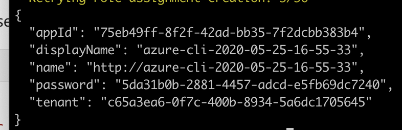

## 1. Terraform

### 1.1 Setup azure service principal for terraform

How to create the service principal and get the info on your subscription

https://docs.microsoft.com/en-us/azure/developer/terraform/install-configure

Get account info
> az account list --query "[].{name:name, subscriptionId:id, tenantId:tenantId}"

Set an environment variable for SUSCRIPTION_ID

Create service principal
> az ad sp create-for-rbac --role="Contributor" --scopes="/subscriptions/${SUBSCRIPTION_ID}"

Make a note of the appId and password.

Set the variables you need

    #!/bin/sh
    echo "Setting environment variables for Terraform"
    export ARM_SUBSCRIPTION_ID=your_subscription_id
    export ARM_CLIENT_ID=your_appId
    export ARM_CLIENT_SECRET=your_password
    export ARM_TENANT_ID=your_tenant_id

    # Not needed for public, required for usgovernment, german, china
    export ARM_ENVIRONMENT=public

Or set those same variables in a var file.
But don't check it in source control! 

### 1.2 Configure the state backend 

https://docs.microsoft.com/en-us/azure/developer/terraform/store-state-in-azure-storage

Create a resource group exclusively for this, the  terraform configuration will be in another resource group.

I chose east us location for this resource group.

    #!/bin/bash

    RESOURCE_GROUP_NAME=tstate
    STORAGE_ACCOUNT_NAME=tstate$RANDOM
    CONTAINER_NAME=tstate

    # Create resource group
    az group create --name $RESOURCE_GROUP_NAME --location eastus

    # Create storage account
    az storage account create --resource-group $RESOURCE_GROUP_NAME --name $STORAGE_ACCOUNT_NAME --sku Standard_LRS --encryption-services blob

    # Get storage account key
    ACCOUNT_KEY=$(az storage account keys list --resource-group $RESOURCE_GROUP_NAME --account-name $STORAGE_ACCOUNT_NAME --query [0].value -o tsv)

    #or look at the first value in
    az storage account keys list --resource-group $RESOURCE_GROUP_NAME --account-name $STORAGE_ACCOUNT_NAME

    # Create blob container
    az storage container create --name $CONTAINER_NAME --account-name $STORAGE_ACCOUNT_NAME --account-key $ACCOUNT_KEY

    echo "storage_account_name: $STORAGE_ACCOUNT_NAME"
    echo "container_name: $CONTAINER_NAME"
    echo "access_key: $ACCOUNT_KEY"

| key | value |
| - | - |
| resource group | tstate|
| storage_account_name| tstate8989 |
| container_name| tstate |
| key vault name |  tstatevaultdani452|
| key vault location| eastus| 
| vault URI | https://tstatevaultdani452.vault.azure.net/ | 

Store the key in Azure vault
> az keyvault create --name "unique name Vault" --resource-group "x" --location eastus

Set the secret
> az keyvault secret set --vault-name "afsadf" --name "TerraformStorageKey" --value "sdwerqwerererererer"

You can now reference this password that you added to Azure Key Vault by using its URI.
https://tstatevaultdani452.vault.azure.net/secrets/TerraformStorageKey/

Query it
> az keyvault secret show --name "ExamplePassword" --vault-name "Contoso-Vault2"

## THIS HAS TO BE DONE EVERYTIME
the rest, only the first time.

Use it to set the env var every time
> export ARM_ACCESS_KEY=$(az keyvault secret show --name "TerraformStorageKey" --vault-name "tstatevaultdani452" --query value -o tsv)
